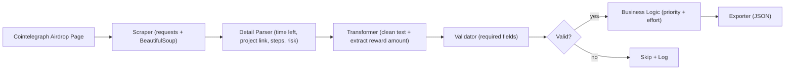

# PPDS Project 2 – Respectful Scraper Pipeline

## Notes

1. We purposely only scrape the first 30 projects that are listed as we're trying to be ethical and follow the assignment's instructions. It would be easy to extend the scraper to all possible results, but again, we were taking into account the ethical outline.
2. Continuing with the theme of ethical scraping, right now we only pull extended data for the first 5 results from the initial 30 we pulled. This is again to try and be ethical to the platform and only focus on the most critical upcoming airdrops. Again, we can extend this if needed.

# 📌 Executive summary (non-technical friendly)

This project implements a **polite, modular web scraper** for Cointelegraph’s [crypto bonus airdrop listings](https://cointelegraph.com/crypto-bonus/bonus-category/airdrop/). In short, we use code to collect information from the website that would otherwise take way too much time!

The scraper is designed for **educational and research purposes**, demonstrating best practices in:

- ✅ Data Quality Assurance (making sure the data has the right types of info)
- ✅ Respectful Scraping (making sure we don't bug the other person's site too much)
- ✅ Business Logic (taking that data and applying to a business case that could make $)
- ✅ Export (clean JSON file that is easy for people to read. It's just text!)

It collects **up to 5 airdrop tasks** per run, goes **one level deeper into detail pages** (to capture time left, project link, steps, etc.), and validates each record before exporting.

---

# 🏗️ Technical architecture diagram



- **Scraper (`scraper.py`)**  
  Fetches HTML, extracts cards, follows detail links. Includes exponential backoff + progress bar (`tqdm`).

- **Transformer (`transformers.py`)**  
  Cleans whitespace, parses reward amounts.

- **Validator (`validators.py`)**  
  Ensures required fields exist (`project_name`, `task_title`).

- **Exporter**  
  Saves results as JSON (`data/sample_output.json`).

---

# ⚙️ Setup & Deployment

1. Clone the repository and enter the project folder:
   ```bash
   git clone <repository-url>
   cd PPDS_assignment2
   ```

2. Create a virtual environment and install dependencies:
   ```bash
   python3 -m venv .venv && source .venv/bin/activate
   pip install -r requirements.txt
   ```

3. Run the scraper:
   ```bash
   cd src
   python3 scraper.py
   ```
3. Dependencies:
   - `requests` (HTTP client)
   - `beautifulsoup4` (HTML parsing)
   - `lxml` (parser backend)
   - `tqdm` (progress bar)

---

# 🚀 Usage

Run the scraper:

```bash
python scraper.py
```

- By default, scrapes **up to 5 airdrop tasks**.
- Saves results to `data/sample_output.json`.
- Console prints validation summary and record preview.

---

# 📈 Performance Metrics (measured locally)

- Pages/min: ~255
- Error rate: 0% (5/5 exported)
- Validation success: 100%
- Test setup: macOS, Python 3.12, zsh, Wi-Fi, 2025-09-13, limit=5

---

## 📜 Documentation

- **ARCHITECTURE.md** — System components and data flow
- **BUSINESS_CASE.md** — Market rationale and use cases
- **AI_USAGE.md** — Prompts, AI-assisted code notes
- **ETHICS.md** — Compliance, legal and ethical framework

---

## ✅ Requirements Mapping

- **Data Quality Assurance** — `validators.py` enforces required fields.
- **Respectful Scraping** — retry/backoff in `scraper.py`, per-run delay.
- **Business Logic** — reward amount extraction + detail page enrichment.
- **Export** — JSON output ready for downstream analysis.
- **Educational Scope** — aligned with PPDS project guidelines.

# Market Research & Problem Discovery

## Problem Statement & Market Size

Airdrops have evolved from small community perks into multi-billion-dollar capital distribution events:

Uniswap (2020): >$6.4B distributed at peak valuation.

Arbitrum (2023): ~$1.5B in tokens.

Optimism, dYdX, Celestia, Starknet: each delivered hundreds of millions in value.

Despite this scale, there is no reliable, standardized, machine-readable aggregator for:

Eligibility requirements

Timelines & claim windows

Sybil/fraud rules

Task normalization across on-chain & off-chain actions

Instead, information is scattered across Twitter threads, Discord servers, and quest platforms, leading to missed opportunities and inefficiency.

Market size:

Global crypto users (2025): ~560M.

Even if 5% pursue airdrops → ~28M potential users.

Airdrops in the last 5 years distributed tens of billions of dollars; missing one can mean thousands lost per user.

Comparable SaaS valuations (Messari, Glassnode, Nansen) prove the market will pay $30–$300/mo for reliable crypto data.

Even a modest wedge — 100k users × $10/mo = $12M ARR — shows commercial viability.

## Why This Data Isn’t Already Available via API

Fragmentation: On-chain events + off-chain tasks live on different platforms; no single API unifies them.

Unreliability: Free trackers often get abandoned or miss major events.

Limited scope / high cost: Paid APIs (CoinGecko, CMC, Nansen) cover price & market data, but not granular airdrop task/eligibility.

No trust layer: Protocols rarely publish structured feeds, leaving users to rely on rumors, screenshots, and threads.

## Potential Users & Willingness to Pay

Retail Hunters → $10–$20/mo.

Need simple alerts & wallet checks.

Value: avoiding missed airdrops.

Semi-Pro Farmers / Agencies → $49–$149/mo.

Need multi-wallet orchestration, ROI tracking, and progress dashboards.

Funds / Research Desks → $299+/mo.

Need exports, APIs, sybil/eligibility analytics, and historical datasets.

Protocols → Enterprise spend.

Want distribution insights, anti-sybil intelligence, and fairness analytics.

Bottom line: Reliability is worth paying for — missing one airdrop is more expensive than a year’s subscription.

## Competitive Analysis

CoinMarketCap Airdrops / Airdrops.io / Galxe

Curated lists, but not normalized or complete.

DefiLlama Airdrops

Good discovery, no wallet-level orchestration or task tracking.

Earnifi / Bankless Claimables

Useful for post-snapshot claim checks, but weak on pre-eligibility orchestration.

Telegram/Discord Bots

Often scam-prone, incomplete, and lack structured APIs.

Gap: A trusted, neutral, machine-readable aggregator offering alerts, eligibility proofs, and full schema normalization.

Precedent: Successful Data Platforms

CoinMarketCap → Acquired by Binance for ~$400M (2020).

CoinGecko → Bootstrapped into a top-100 global site, monetizing via API subscriptions.

Messari → Raised $100M+ to build a “Bloomberg for Web3.”

Nansen → Raised $75M+ for wallet/airdrop analytics.

DefiLlama → Community aggregator turned indispensable infrastructure.

Lesson: Trusted crypto data platforms consistently scale into billion-dollar assets.

👉 Opportunity: Build the “Bloomberg Terminal for airdrops” — a reliable, structured, machine-readable source for one of the largest and fastest-growing capital distribution channels in crypto.

# Technical Feasibility Study

1. We analyzed our website's structure.
2. Times left until a launch are loaded in dynamically through JS so we added a delay when it came to scraping them off of the detailed view pages. Otherwise our approach should work fine. We'll also be targeting the outermost div and then dealing with its internal contents since the structure of the exact fields sometimes changes.
3. The challenge matrix is listed below

| Challenge                 | Difficulty (1–5) | Solution Strategy                                                              |
| ------------------------- | ---------------- | ------------------------------------------------------------------------------ |
| Dynamic JS content        | 4                | Using data-timer instead of the actual timer elements along with a 2s delay    |
| Rate limiting             | 3                | Max 3 retries per run, exponential backoff from 1s to 2s to 4s                 |
| Data structure variations | 2                | We collect the base data using the outermost element CSS class first           |
| Session management        | 3                | User-agent strings, accept headers, language prefs, and connection keep-alive. |

# Scraper Requirements and Structure

1. Data Quality Assurance - we console log the number of scraped airdrops include valid data. Since the schema is the same, but data is a bit inconsistent, we're going to count cases here where an airdrop has a name as well as a task as valid.

2. Respectful Scraping - we set a maximum number of retires at 3 for the main page. If we're being rate limited it will likely start there vs on the sub pages so it makes more sense to put it there. That's our retry limit. As for our exponential backoff, between each failed request we go from 1 second to 2 seconds to 3 seconds.

3. Business Logic - we work across pages to first get the directory of all the airdrops and then go into more depth. We then merge these two versions of the data together to get a cohesive response for the airdrop data. The value added here is that we aggregate across the 100+ potential airdrops that are rotating at any given time the relevant fields that our target audience would care about making it easy for them to asses opportunities and sort. We also added an urgency field where it will be between LOW, MEDIUM, to HIGH depending on how soon the airdrop opportunity will be expiring.

4. Exporting to CSV - we log all results to the console as well as to the ./data/sample_output.json file.

# 1. Pre-Implementation Planning

### Data collection priorities (what to scrape first and why)

We're going to first collect the information on the directory page. This is because that data contains the sub URLs for the more in depth data for each of the airdrops. After we compile those we'll then iterate through them and enrich those records.

### Fallback strategies for common failures

We have two main fallback strategies. The first of which is if we're being rate limited we have an exponential retry to continue to collect the data if the first attempt fails. Again this is ethical and we limited it to a maximum of 3 attempts. The second of these fallback strategies is to pull the time from the data-timestamp attribute if the JS does not load in properly.

### Data quality validation rules

While a lot of the airdrops might have slightly differing fields, there are two main ones that matter: the project name and the specific action that is needed to qualify. Our scraper takes this into account and only defines a scraped record as valid if it includes both a project name as well as task. We log the number of valid results in the console on each run.

### Update frequency justification (do you need it every hour, day, minute, year, only once?!)

For our purposes it makes the most sense to scrape twice a day. While time is important, these timelines for airdrop expirations often span a week or more, meaning that a single period of 12 hours is unlikely to have a major impact. Again, this could be higher or lower, just based on ethics we're sitting on the side of the minimum.
