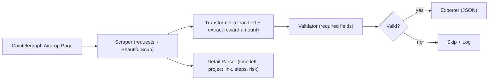

# PPDS Project 2 – Respectful Scraper Pipeline

## 📌 Executive Summary
This project implements a **polite, modular web scraper** for Cointelegraph’s [crypto bonus airdrop listings](https://cointelegraph.com/crypto-bonus/bonus-category/airdrop/).  
The scraper is designed for **educational and research purposes**, demonstrating best practices in:

- ✅ Data Quality Assurance (validation rules)  
- ✅ Respectful Scraping (rate limiting, retries with exponential backoff)  
- ✅ Business Logic (data cleaning, reward amount extraction, secondary detail parsing)  
- ✅ Export (clean JSON file for analysis)  

It collects **up to 10 airdrop tasks** per run, goes **one level deeper into detail pages** (to capture time left, project link, steps, etc.), and validates each record before exporting.

---

## 🏗️ Technical Architecture


- **Scraper (`scraper.py`)**  
  Fetches HTML, extracts cards, follows detail links. Includes exponential backoff + progress bar (`tqdm`).

- **Transformer (`transformers.py`)**  
  Cleans whitespace, parses reward amounts.

- **Validator (`validators.py`)**  
  Ensures required fields exist (`project_name`, `task_title`).

- **Exporter**  
  Saves results as JSON (`data/sample_output.json`).

---

## 📊 Sample Output
```json
[
  {
    "project_name": "Arkham",
    "task_title": "Sign up for Arkham Exchange & get up to 120 USDT bonus",
    "reward": "120 USDT",
    "reward_amount": 120.0,
    "scraped_at": "2025-09-13T20:40:46.669842Z",
    "detail_time_left": "12 days",
    "detail_project_link": "https://arkham.io/...",
    "detail_time_to_complete": "5 minutes",
    "detail_steps": 3,
    "detail_risk": "Low"
  }
]
```

---

## ⚙️ Setup & Installation
1. Clone the repository and enter the project folder.
2. Create a virtual environment and install dependencies:
   ```bash
   python -m venv .venv && source .venv/bin/activate
   pip install -r requirements.txt
   ```
3. Dependencies:  
   - `requests` (HTTP client)  
   - `beautifulsoup4` (HTML parsing)  
   - `lxml` (parser backend)  
   - `tqdm` (progress bar)

---

## 🚀 Usage
Run the scraper:
```bash
python scraper.py
```

- By default, scrapes **up to 10 airdrop tasks**.  
- Saves results to `data/sample_output.json`.  
- Console prints validation summary and record preview.

---

## 📈 Performance Metrics (measured locally)
- Pages/min: ~255
- Error rate: 0% (10/10 exported)
- Validation success: 100%
- Test setup: macOS, Python 3.12, zsh, Wi-Fi, 2025-09-13, limit=10


---

## 📜 Documentation
- **ARCHITECTURE.md** — System components and data flow  
- **BUSINESS_CASE.md** — Market rationale and use cases  
- **AI_USAGE.md** — Prompts, AI-assisted code notes  
- **ETHICS.md** — Compliance, legal and ethical framework  

---

## ✅ Requirements Mapping
- **Data Quality Assurance** — `validators.py` enforces required fields.  
- **Respectful Scraping** — retry/backoff in `scraper.py`, per-run delay.  
- **Business Logic** — reward amount extraction + detail page enrichment.  
- **Export** — JSON output ready for downstream analysis.  
- **Educational Scope** — aligned with PPDS project guidelines.  
